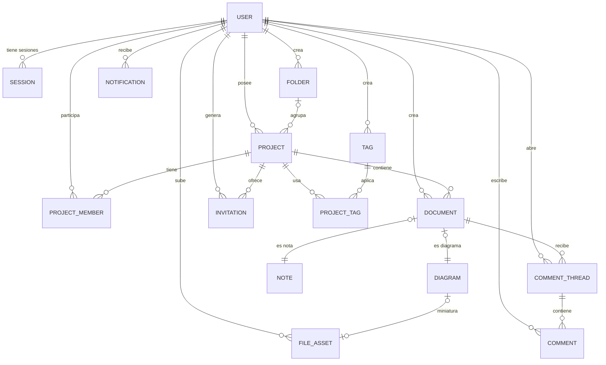

# 05 · Modelo de datos

Motor: **PostgreSQL 16+** · ORM: **Prisma**. Los nombres de tablas y campos en `snake_case` (convención Prisma con `@@map`/`@map`).

---

## 5.1 Diagrama entidad-relación

> Las tablas `session`, `account` y `verification` las gestiona **better-auth**; `USER` es su tabla `user`, que la app usa como tabla de usuarios. En el MVP `emailVerified` permanece `false` (no hay verificación por email).

---

## 5.2 Tablas de autenticación (gestionadas por better-auth)

| Tabla | Campos relevantes | Notas |
|-------|-------------------|-------|
| `user` | `id`, `name`, `email` (único, minúsculas), `emailVerified`, `image`, `createdAt`, `updatedAt` | Es la tabla de usuarios de la app. |
| `session` | `id`, `userId`, `token`, `expiresAt`, `ipAddress`, `userAgent` | Sesiones de 30 días con renovación. |
| `account` | `id`, `userId`, `providerId` (`credential`), `accountId`, `password` (hash) | La contraseña vive aquí, con hash. |
| `verification` | `id`, `identifier`, `value`, `expiresAt` | Reservada; sin uso en el MVP. |

---

## 5.3 Tablas de dominio

### `folder` — Carpetas (por usuario)

| Campo | Tipo | Notas |
|-------|------|-------|
| `id` | `cuid` PK | |
| `user_id` | FK → user | La carpeta es privada de su dueño. |
| `name` | `varchar(80)` | Único por usuario. |
| `created_at` / `updated_at` | `timestamptz` | |

### `tag` — Etiquetas (por usuario)

| Campo | Tipo | Notas |
|-------|------|-------|
| `id` | `cuid` PK | |
| `user_id` | FK → user | Privada de su dueño. |
| `name` | `varchar(50)` | Única por usuario (sin distinguir mayúsculas). |
| `created_at` | `timestamptz` | |

### `project` — Proyectos

| Campo | Tipo | Notas |
|-------|------|-------|
| `id` | `cuid` PK | |
| `owner_id` | FK → user | Propietario actual (transferible en F2). |
| `folder_id` | FK → folder, nullable | Carpeta del **owner** únicamente (la organización es personal). |
| `name` | `varchar(120)` | |
| `description` | `text`, nullable | |
| `status` | enum `ProjectStatus` (`ACTIVE` \| `ARCHIVED`) | |
| `archived_at` | `timestamptz`, nullable | |
| `created_at` / `updated_at` | `timestamptz` | |

### `project_member` — Membresías

| Campo | Tipo | Notas |
|-------|------|-------|
| `id` | `cuid` PK | |
| `project_id` | FK → project | `ON DELETE CASCADE`. |
| `user_id` | FK → user | `ON DELETE CASCADE`. |
| `role` | enum `ProjectRole` (`OWNER` \| `EDITOR` \| `VIEWER`) | |
| `favorite` | `boolean` = `false` | Favorito **por usuario**. |
| `last_opened_at` | `timestamptz`, nullable | Sección «Recientes». |
| `created_at` | `timestamptz` | |

Restricciones: `UNIQUE(project_id, user_id)` · índice `(user_id)` · invariante de negocio: todo proyecto tiene **al menos un** `OWNER` (garantizado en la capa de servicio).

### `project_tag` — Proyectos ↔ Etiquetas

| Campo | Tipo |
|-------|------|
| `project_id` | FK → project, `ON DELETE CASCADE` |
| `tag_id` | FK → tag, `ON DELETE CASCADE` |

PK compuesta `(project_id, tag_id)`.

### `document` — Documentos (notas y diagramas)

| Campo | Tipo | Notas |
|-------|------|-------|
| `id` | `cuid` PK | |
| `project_id` | FK → project | `ON DELETE CASCADE`. |
| `type` | enum `DocumentType` (`NOTE` \| `DIAGRAM`) | |
| `title` | `varchar(160)` | Editable en línea. |
| `created_by_id` | FK → user, `ON DELETE SET NULL` | |
| `revision` | `integer` = 1 | Control de concurrencia optimista. |
| `created_at` / `updated_at` | `timestamptz` | Índice `(project_id, updated_at desc)` y `(project_id, type)`. |

### `note` — Contenido de notas (1:1 con `document`)

| Campo | Tipo | Notas |
|-------|------|-------|
| `document_id` | PK, FK → document | `ON DELETE CASCADE`. |
| `content_json` | `jsonb` | Documento Tiptap (nodos/marks whitelist). |
| `content_text` | `text` | Texto plano extraído al guardar; alimenta la búsqueda. |

### `diagram` — Contenido de diagramas (1:1 con `document`)

| Campo | Tipo | Notas |
|-------|------|-------|
| `document_id` | PK, FK → document | `ON DELETE CASCADE`. |
| `scene_json` | `jsonb` | Escena Excalidraw: `elements`, `appState` relevante y referencias a assets (sin binarios). |
| `thumbnail_file_id` | FK → file_asset, nullable | Miniatura PNG generada al guardar. |

### `file_asset` — Archivos subidos

| Campo | Tipo | Notas |
|-------|------|-------|
| `id` | `cuid` PK | |
| `project_id` | FK → project | `ON DELETE CASCADE`. El acceso se valida por membresía. |
| `uploader_id` | FK → user, `ON DELETE SET NULL` | |
| `kind` | enum `AssetKind` (`IMAGE` \| `ATTACHMENT` \| `THUMBNAIL`) | |
| `mime_type` | `varchar(100)` | Whitelist. |
| `size_bytes` | `integer` | Límite 20 MB. |
| `original_name` | `varchar(255)` | Solo informativo (el nombre real en disco es UUID). |
| `storage_key` | `varchar(255)` único | Ruta relativa dentro del volumen `uploads/`. |
| `width` / `height` | `integer`, nullable | Para imágenes. |
| `created_at` | `timestamptz` | |

### `comment_thread` — Hilos de comentarios

| Campo | Tipo | Notas |
|-------|------|-------|
| `id` | `cuid` PK | |
| `document_id` | FK → document | `ON DELETE CASCADE`. |
| `author_id` | FK → user, `ON DELETE SET NULL` | |
| `anchor` | `jsonb`, nullable | `null` = general; `{type:"note", blockId}`; `{type:"diagram", elementId}`. |
| `status` | enum `ThreadStatus` (`OPEN` \| `RESOLVED`) | |
| `resolved_at`, `resolved_by_id` | nullable | |
| `created_at` | `timestamptz` | Índice `(document_id, status)`. |

### `comment` — Mensajes de un hilo

| Campo | Tipo | Notas |
|-------|------|-------|
| `id` | `cuid` PK | |
| `thread_id` | FK → comment_thread | `ON DELETE CASCADE`. |
| `author_id` | FK → user, `ON DELETE SET NULL` | |
| `body` | `varchar(4000)` | Soporta menciones `@usuario`. |
| `edited_at` | `timestamptz`, nullable | |
| `created_at` | `timestamptz` | Índice `(thread_id, created_at)`. |

### `invitation` — Invitaciones por enlace

| Campo | Tipo | Notas |
|-------|------|-------|
| `id` | `cuid` PK | |
| `project_id` | FK → project | `ON DELETE CASCADE`. |
| `role` | enum `ProjectRole` (`EDITOR` \| `VIEWER`) | Nunca `OWNER`. |
| `token` | `varchar(64)` único | Aleatorio criptográfico; viaja en la URL. |
| `created_by_id` | FK → user, `ON DELETE SET NULL` | |
| `expires_at` | `timestamptz` | 1/7/30 días. |
| `used_at`, `used_by_id` | nullable | Un solo uso. |
| `revoked_at` | nullable | |
| `created_at` | `timestamptz` | Índice `(project_id)`. |

### `notification` — Notificaciones in-app

| Campo | Tipo | Notas |
|-------|------|-------|
| `id` | `cuid` PK | |
| `user_id` | FK → user | `ON DELETE CASCADE`. |
| `type` | enum `NotificationType` | `PROJECT_ADDED`, `COMMENT_NEW`, `THREAD_REPLY`, `MENTION`, `ROLE_CHANGED`, `PROJECT_ARCHIVED`, `PROJECT_DELETED`. |
| `payload` | `jsonb` | `{ projectId, documentId?, threadId?, commentId?, actorId, snippet? }`. |
| `read_at` | `timestamptz`, nullable | |
| `created_at` | `timestamptz` | Índices `(user_id, read_at)` y `(created_at)`. Limpieza > 90 días. |

### `link_preview` — Caché de vistas previas de enlaces

| Campo | Tipo | Notas |
|-------|------|-------|
| `id` | `cuid` PK | |
| `url_hash` | `varchar(64)` único | SHA-256 de la URL normalizada. |
| `url` | `text` | |
| `title`, `description`, `site_name` | nullable | Metadatos OpenGraph. |
| `image_key` | `varchar(255)`, nullable | Imagen descargada como asset global. |
| `fetched_at` | `timestamptz` | TTL: se refetchea a los 30 días. |

---

## 5.4 Borrado en cascada (resumen)

| Se elimina… | Efecto |
|-------------|--------|
| Proyecto | Cascada: membresías, documentos (y notas/diagramas/hilos/comentarios), invitaciones, assets del proyecto. |
| Documento | Cascada: nota o diagrama, hilos y comentarios. |
| Miembro | No borra sus documentos ni comentarios; quedan atribuidos a «usuario eliminado» (`SET NULL`). |
| Cuenta (F2) | Sus proyectos **propios** requieren decisión (transferir o eliminar); como miembro solo pierde acceso. |
| Etiqueta / Carpeta | No borra proyectos: solo la agrupación. |

No hay *soft delete* en el MVP (sin papelera). Los archivos huérfanos se limpian con un script manual documentado.

---

## 5.5 Búsqueda

**MVP:** extensión `unaccent` + `pg_trgm`; la búsqueda usa `ILIKE unaccent(...)` con índices GIN por trigramas sobre:

- `project.name`, `project.description`
- `document.title`
- `note.content_text`

Filtrado siempre por membresía (`EXISTS` sobre `project_member`).

**F2:** migrar a `tsvector` con configuración `spanish` y columna generada, para ranking por relevancia.

## 5.6 Reglas de integridad y convenciones

- IDs `cuid()` legibles en URLs; nunca autoincrementales expuestos.
- Fechas `timestamptz` (UTC en servidor; formateadas al mostrar).
- Enums a nivel de base de datos (Prisma `enum`).
- Toda tabla de dominio tiene `created_at`; las editables, `updated_at`.
- Los `jsonb` (notas, escenas, anclas) se validan en servidor con Zod antes de persistir.
- Imágenes y adjuntos **nunca** se guardan como base64 en la base de datos: van al volumen `uploads/` y la base solo guarda metadatos.
