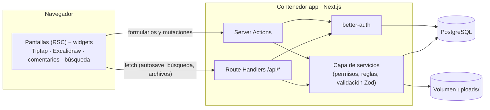
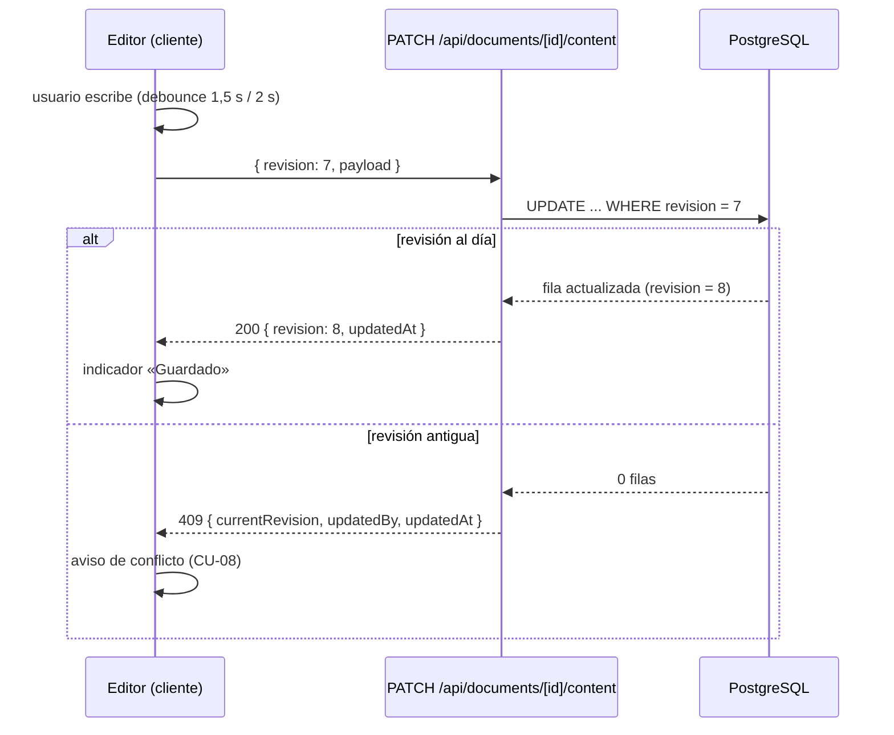

# 06 · Arquitectura técnica

## 6.1 Principios técnicos

1. **Monolito fullstack en Next.js**: UI, API y lógica en un solo proyecto y despliegue. Menos piezas, más fácil de operar en una PC propia.
2. **El servidor decide**: permisos, validación y reglas de negocio viven en `src/server/`; la UI nunca es la autoridad.
3. **RSC primero**: las pantallas se renderizan en servidor con React Server Components; el estado de cliente se reserva para lo interactivo (editores, buscador, comentarios, notificaciones).
4. **REST + Server Actions** como interfaz: sin capas extra (tRPC/GraphQL) que no aportan con un único cliente.
5. **Datos portables**: PostgreSQL + carpeta `uploads/`. Un backup son un dump y un tar.

## 6.2 Stack

| Capa | Tecnología | Versión mínima | Por qué |
|------|-----------|----------------|---------|
| Framework | **Next.js (App Router)** | 15 | RSC, server actions, route handlers, standalone build para Docker. |
| Lenguaje | **TypeScript** (strict) | 5.4 | Seguridad de tipos en todo el proyecto. |
| UI | **React** | 19 | Requisito de Excalidraw/Tiptap; ecosistema. |
| Estilos | **Tailwind CSS** + **shadcn/ui** (Radix) | 4 | Desarrollo rápido, accesible, componentes propios. |
| Iconos | lucide-react | — | Coherente con shadcn/ui. |
| Tipografías | Inter / fuente del sistema | — | Legibilidad. |
| Auth | **better-auth** | última estable | Email+contraseña, sesiones, rate limit, adaptador Prisma, sin proveedor externo. |
| ORM | **Prisma** | 6 | Migraciones versionadas y tipado del esquema. |
| Base de datos | **PostgreSQL** | 16 | Relacional + JSONB + búsqueda con extensiones. |
| Editor de notas | **Tiptap** (ProseMirror) | 3 | Extensiones: formato, checklists, imágenes, enlaces, menciones. |
| Editor de diagramas | **@excalidraw/excalidraw** | 0.18 | Requisito «estilo Excalidraw», MIT, embebible en React. |
| Datos de cliente | **TanStack Query** | 5 | Búsqueda, notificaciones, panel de comentarios (refetch/polling). |
| Formularios | react-hook-form + **Zod** | — | Validación compartida cliente/servidor. |
| Fechas | date-fns (locale `es`) | — | Formato y distancias («hace 2 h»). |
| Toasts | sonner | — | Feedback de acciones. |
| Pruebas | Vitest + Playwright | — | Unidad e2e. |
| Empaquetado | Docker + Docker Compose | — | Despliegue en la PC servidor. |
| Reverse proxy (opcional) | Caddy | 2 | TLS automático si se expone con dominio. |

## 6.3 Arquitectura



En fase 2 se añade un servicio de sincronización en vivo (Liveblocks en la nube o Hocuspocus en el mismo VPS) del que la app solo consume eventos; **las tablas de Postgres siguen siendo la fuente de verdad** (ver 6.10).

## 6.4 Estructura de carpetas propuesta

```
planify/
├─ docs/                          # esta documentación
├─ prisma/
│  ├─ schema.prisma
│  └─ migrations/
├─ public/                        # estáticos propios (logo, favicon)
├─ scripts/
│  ├─ backup.sh                   # dump + uploads + rotación
│  └─ reset-password.mjs          # reset administrativo (RF-105)
├─ src/
│  ├─ app/
│  │  ├─ (auth)/login|register/   # públicas
│  │  ├─ invite/[token]/          # aceptación de invitaciones
│  │  ├─ (app)/                   # área privada con sidebar
│  │  │  ├─ page.tsx              # inicio (proyectos activos)
│  │  │  ├─ favorites|recent|archived/
│  │  │  ├─ folders/[folderId]/ · tags/[tagId]/
│  │  │  ├─ search/ · notifications/
│  │  │  ├─ settings/profile/
│  │  │  └─ projects/[projectId]/
│  │  │     ├─ page.tsx           # lista de documentos
│  │  │     ├─ settings/          # miembros e invitaciones
│  │  │     └─ documents/[documentId]/   # nota o diagrama
│  │  └─ api/                     # route handlers (ver doc 07)
│  ├─ components/
│  │  ├─ ui/                      # shadcn/ui
│  │  ├─ layout/                  # sidebar, topbar, breadcrumbs
│  │  ├─ projects/ · documents/   # listas, tarjetas, formularios
│  │  ├─ editor/                  # Tiptap y extensiones
│  │  ├─ diagram/                 # envoltorio de Excalidraw
│  │  ├─ comments/ · notifications/
│  ├─ lib/
│  │  ├─ auth.ts · auth-client.ts # better-auth
│  │  ├─ prisma.ts                # cliente singleton
│  │  ├─ storage.ts               # guardar/leer assets en disco
│  │  ├─ link-preview.ts          # OpenGraph con protección SSRF
│  │  ├─ env.ts                   # variables validadas con Zod
│  │  └─ texts.ts                 # textos de UI (futura i18n)
│  ├─ server/
│  │  ├─ permissions.ts           # requireProjectRole(...)
│  │  ├─ services/                # projects, documents, comments, sharing, search, notifications
│  │  └─ validators/              # schemas Zod compartidos
│  └─ styles/
├─ tests/
│  ├─ unit/                       # Vitest
│  └─ e2e/                        # Playwright
├─ docker/
│  ├─ Dockerfile · entrypoint.sh · Caddyfile
├─ docker-compose.yml · docker-compose.dev.yml
├─ .env.example
└─ package.json
```

## 6.5 Capas y convenciones

| Capa | Responsabilidad | Reglas |
|------|-----------------|--------|
| `app/` (RSC + route handlers) | Entrada HTTP, render, orquestación fina. | No contiene reglas de negocio; delega en servicios. |
| `components/` | Presentación e interacción. | Los componentes de cliente no llaman a Prisma jamás. |
| `server/services/` | Reglas de negocio y acceso a datos. | Toda función recibe el contexto de sesión y verifica permisos; devuelve errores tipados. |
| `server/permissions.ts` | Autorización centralizada. | `requireProjectRole(userId, projectId, 'VIEWER'|'EDITOR'|'OWNER')` usado por *todos* los servicios. |
| `server/validators/` | Schemas Zod de entrada/salida. | Se reutilizan en el cliente para formularios. |
| `lib/` | Utilidades transversales sin estado. | Storage, link preview, env, auth. |

Convenciones: componentes en `PascalCase`, funciones en `camelCase`, tablas en `snake_case`, errores como códigos (`FORBIDDEN`, `CONFLICT`…) definidos en un único módulo.

## 6.6 Flujos técnicos clave

### 6.6.1 Autoguardado con control de revisión (RF-406, RF-407)



Detalles: el cliente calcula un hash de escena (`getSceneVersion` de Excalidraw) o compara el JSON de la nota para no enviar guardados vacíos. El servidor extrae `content_text` de las notas en cada guardado (RF-506).

### 6.6.2 Assets y rehidratación de Excalidraw (RF-603)

1. Al pegar/soltar una imagen en el diagrama, el cliente la sube a `POST /api/files` y recibe `{ id, url }`.
2. La escena guarda `elements` con sus `fileId` de Excalidraw y un mapa `assets: { [excalidrawFileId]: assetId }` dentro de `scene_json`. **Nunca binarios**.
3. Al cargar, el servidor entrega el mapa; el cliente pide cada asset y construye el objeto `files` que Excalidraw espera (`{ [fileId]: { id, mimeType, dataURL } }`) y lo pasa en `initialData.files`.
4. Así el JSONB se mantiene pequeño y las imágenes se sirven autenticadas desde `GET /api/files/[id]`.

### 6.6.3 Miniaturas (RF-604)

Al guardar un diagrama, el cliente genera un PNG con `exportToBlob` (ancho ~480 px), lo sube como asset `THUMBNAIL` y guarda su id en `diagram.thumbnail_file_id`. La lista de documentos usa esa imagen.

### 6.6.4 Vista previa de enlaces (RF-505)

`GET /api/link-preview?url=…` → el servidor descarga el HTML (timeout 5 s, máx. 1 MB), parsea OpenGraph y guarda en `link_preview`. **Protección SSRF**: solo `http(s)`, se resuelve el DNS y se bloquean rangos privados/loopback/link-local, máximo 3 redirecciones, user-agent propio. El cliente inserta una tarjeta con esos datos; si falla, enlace simple.

### 6.6.5 Búsqueda (RF-303)

Consulta SQL con `unaccent` + `ILIKE` sobre `project.name/description`, `document.title` y `note.content_text`, siempre con `EXISTS` de membresía. Resultados agrupados por tipo con fragmento de contexto y límite 50 por grupo.

### 6.6.6 Notificaciones (RF-904)

Se crean en los servicios al ocurrir los eventos (nuevo comentario, mención, miembro agregado…). El cliente consulta `GET /api/notifications` con TanStack Query cada 30 s (y al navegar); en F2 pasarán a empujarse por el canal de tiempo real.

## 6.7 Integración de Excalidraw (detalles)

- Importación **dinámica sin SSR**: `next/dynamic` con `ssr: false` y `import "@excalidraw/excalidraw/index.css"` solo en esa ruta (bundle grande; fuera del resto de la app).
- Props usadas: `initialData` (elements, appState subset, files), `onChange`, `excalidrawAPI`, `langCode="es-ES"`, `theme`, `viewModeEnabled` (viewers), `UIOptions` para ocultar lo no deseado.
- `serializeAsJSON` / `restore` para (de)serializar; solo se persiste un **subset** de `appState` (zoom, scroll, fondo, gridSize) para no guardar estado efímero.
- El guardado se dispara por debounce tras `onChange`, saltando cambios sin relevancia según `getSceneVersion`.

## 6.8 Editor de notas Tiptap (detalles)

Extensiones: `StarterKit` (párrafos, títulos, listas, negrita/cursiva, cita, código en línea), `Underline`, `TaskList`/`TaskItem` (checklists RF-502), `Image` (RF-503), `Link` + nodo propio `bookmark` (RF-505), `Placeholder`, `CharacterCount`, y un nodo propio de **adjunto** (`attachment` con fileId/tamaño). El contenido se guarda como JSON de Tiptap validado contra una whitelist de nodos/marks antes de persistir y al renderizar.

## 6.9 Decisiones y alternativas descartadas

| Tema | Elegido | Descartado | Motivo |
|------|---------|-----------|--------|
| Framework | Next.js | Vite+React SPA con backend aparte; SvelteKit; Nuxt | Un repo y un contenedor; RSC; además Excalidraw/Tiptap son React. |
| Editor | Excalidraw embebido | tldraw; editor propio; React Flow | Requisito explícito «estilo Excalidraw»; MIT; ahorro enorme de desarrollo. |
| Auth | better-auth | Auth.js; Clerk; Supabase Auth; auth propio | Email+contraseña self-hosted sin proveedor; adaptador Prisma directo. |
| Interfaz interna | REST (route handlers) + server actions | tRPC; GraphQL | Suficiente con un solo cliente; menos dependencias y curva. |
| ORM | Prisma | Drizzle; SQL a mano | Migraciones y DX maduras. |
| BD | PostgreSQL | SQLite; MongoDB | Relaciones + JSONB + búsqueda; MongoDB no aporta aquí. |
| Repo | Proyecto único | Monorepo con paquetes | No hay más consumidores; YAGNI. |
| Estado cliente | RSC + TanStack Query puntual | Redux/Zustand global | La mayoría del estado vive en servidor. |

## 6.10 Fase 2 · Capa de tiempo real

Diseño previsto: un módulo `src/lib/realtime/` con una interfaz `DocumentSync` (`connect`, `onRemoteChange`, `broadcast…`) para que la app no dependa del proveedor. Opciones evaluadas (estado 2026):

| Opción | Ventaja | Coste/riesgo |
|--------|---------|--------------|
| **Liveblocks (recomendada)** | Comentarios, presencia y notificaciones ya hechos; free tier suficiente para uso personal; integración Yjs. | Dependencia de nube externa; datos en vivo pasan por su servicio (los snapshots siguen en Postgres). |
| **Yjs + Hocuspocus self-hosted** | Cero dependencias; todo en el VPS. | Implementar binding de Excalidraw (paquete comunitario `y-excalidraw`/starters), presencia, comentarios y notificaciones a medida; más mantenimiento. |
| **PartyKit / Cloudflare** | WebSockets en el edge, free tier amplio. | Escribir toda la lógica; sigue siendo nube externa. |

Impacto en el modelo de datos: **ninguno**. El autoguardado con revisión se mantiene como mecanismo de persistencia; el tiempo real solo añade transporte en vivo entre clientes y el servidor sigue generando snapshots.
