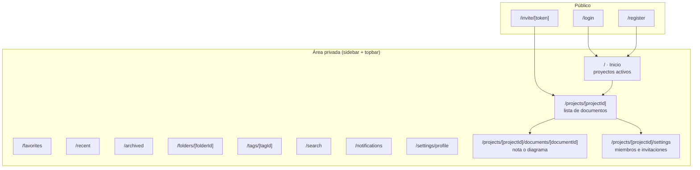
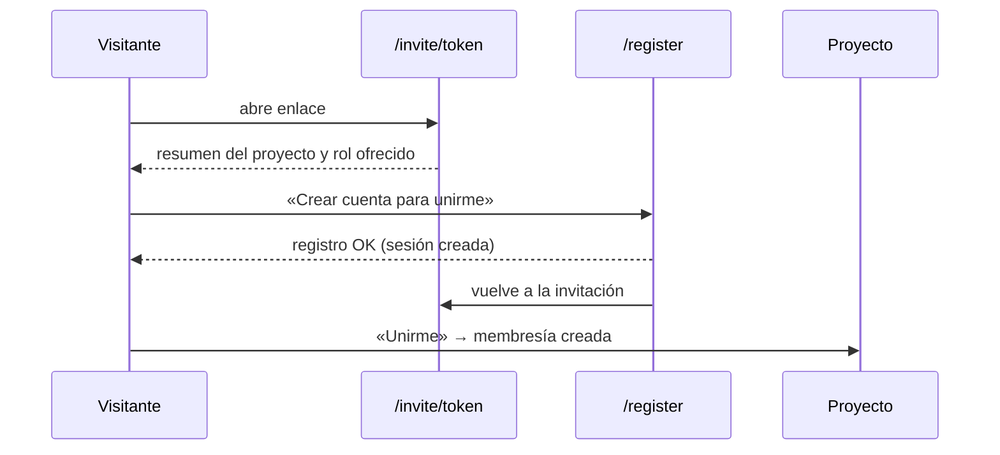
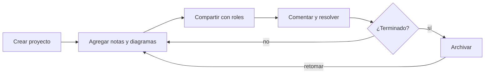
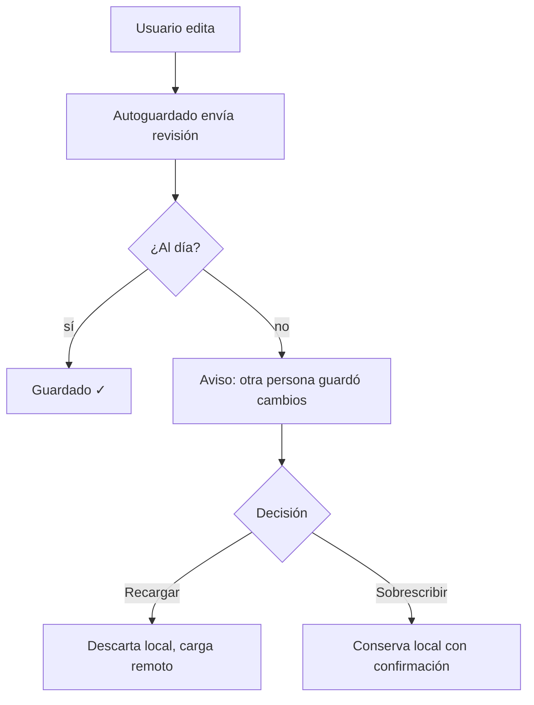

# 08 · Pantallas y flujos

## 8.1 Principios de UX

1. **Todo a un par de clics**: crear nota/diagrama siempre visible dentro de un proyecto.
2. **El estado se ve**: indicadores de guardado, roles visibles, hilos abiertos con contador.
3. **Nada destructivo sin confirmación** y mensajes de error en español y accionables.
4. **Densidad cómoda**: interfaz limpia, con el contenido como protagonista (los editores ocupan la pantalla).
5. **Desktop-first**, móvil para consulta y comentarios (RNF-02).

## 8.2 Mapa de pantallas

| Ruta | Pantalla | Acceso |
|------|----------|--------|
| `/login`, `/register` | Autenticación. | Visitante |
| `/invite/[token]` | Aceptar invitación (con o sin cuenta). | Visitante / Usuario |
| `/` | Inicio: proyectos activos con búsqueda y filtros. | Miembro |
| `/favorites`, `/recent`, `/archived` | Vistas guardadas. | Miembro |
| `/folders/[id]`, `/tags/[id]` | Proyectos filtrados por carpeta/etiqueta. | Dueño (son personales) |
| `/search` | Resultados de búsqueda global. | Miembro |
| `/notifications` | Centro de notificaciones. | Miembro |
| `/settings/profile` | Perfil y contraseña. | Usuario |
| `/projects/[id]` | Cabecera del proyecto + lista de documentos. | Miembro |
| `/projects/[id]/documents/[docId]` | Nota (editor) o diagrama (Excalidraw). | Miembro |
| `/projects/[id]/settings` | Miembros, invitaciones, archivar/eliminar. | Miembro (acciones según rol) |

## 8.3 Descripción por pantalla

### Autenticación (`/login`, `/register`)
Tarjeta centrada: nombre/email/contraseña, validación en vivo, enlaces entre login y registro. Si hay una invitación pendiente en la URL, se muestra un aviso («Te están invitando a *Proyecto X*»).

### Inicio (`/`)
Sidebar + topbar. Contenido: botón «Nuevo proyecto», buscador y tarjetas de proyecto (nombre, descripción, nº documentos, avatares de miembros, favorito). Estados vacíos con llamada a la acción. En cada tarjeta: menú contextual (editar, mover a carpeta, etiquetas, archivar, eliminar).

### Proyecto (`/projects/[id]`)
Cabecera: nombre, descripción, avatares de miembros, botón «Compartir» (si owner), menú de acciones. Cuerpo: «Nuevo documento» (nota/diagrama) y lista de documentos con tipo, título, autor, fecha y miniatura del diagrama.

### Documento · Nota
Título editable en línea, indicador de guardado, panel lateral de comentarios (colapsable), toolbar de formato, área de escritura amplia. Pegar imagen o URL funciona desde el propio editor.

### Documento · Diagrama
Excalidraw a pantalla completa; barra superior propia con: volver al proyecto, título editable, estado de guardado, botón de comentarios (contador) y presencia de miembros (F2). Vista previa en solo lectura para viewers.

### Compartir (`/projects/[id]/settings`)
Pestañas: **Miembros** (lista, roles, agregar por email), **Invitaciones** (crear enlace por rol/caducidad, copiar, revocar), **Zona peligrosa** (archivar, eliminar con confirmación por nombre). Visible para owner; lectores/editors ven la pestaña en solo lectura si acceden.

### Búsqueda (`/search`)
Campo grande + filtros por tipo/carpeta/etiqueta/estado. Resultados agrupados con fragmento resaltado; navegación con teclado.

### Notificaciones
Lista tipada con iconos, fecha relativa y enlace al origen; contador en la campana; «Marcar todas como leídas».

## 8.4 Flujos clave

### Registro llegando desde una invitación (CU-11)

### Ciclo de vida de un proyecto

### Conflicto de guardado (CU-08)

## 8.5 Estados y feedback

| Estado | Comportamiento |
|--------|----------------|
| Cargando | Skeletons en listas y paneles; nunca pantallas en blanco. |
| Vacío | Ilustración/mensaje + CTA («Crea tu primer diagrama»). |
| Error | Mensaje claro + botón de reintento; los detalles van al log. |
| Sin permiso | Vista de solo lectura clara (sin acciones) o 404 si no es miembro. |
| Guardando | Indicador «Guardando…» → «Guardado» en la barra del documento. |
| Conflicto | Diálogo con «Recargar» / «Sobrescribir» (nunca automático). |
| Sin conexión (red local caída) | Aviso de que los cambios no se están guardando; reintento al volver. |

## 8.6 Navegación y atajos

- `Ctrl/⌘ + K`: abrir búsqueda global.
- `Ctrl/⌘ + S`: forzar guardado inmediato del documento.
- `Esc`: cerrar paneles/diálogos.
- `N` (en un proyecto): nuevo documento → nota; `D`: diagrama (solo sin foco en editor).
- Todos los atajos documentados en una ayuda accesible desde el menú de usuario.

## 8.7 Responsive y accesibilidad

- **≥1024 px**: sidebar expandida y panel de comentarios lateral en los documentos.
- **768–1024 px**: sidebar expandida; los comentarios pasan debajo del editor.
- **<768 px (móvil/tablet)**: navegación con **drawer** (cabecera con menú, campana y búsqueda); notas editables y comentarios completos; los diagramas se ven en un lienzo a pantalla ancha (mejor en desktop).
- Foco visible, `aria-current` en la navegación, enlace «Saltar al contenido», navegación por teclado en formularios/listas y contraste AA (RNF-03).
- Atajos documentados en la app (menú de usuario → «Atajos de teclado»).
