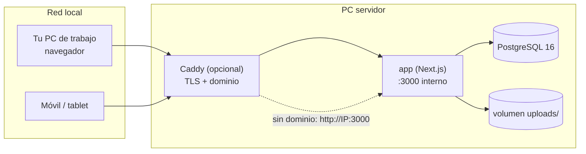

# 10 · Despliegue y operación

## 10.1 Escenario

Planify vivirá en **otra PC de casa actuando como servidor**, con Docker. El acceso principal será por **red local**; exponerlo a Internet con dominio es opcional y se documenta como perfil adicional.



## 10.2 Requisitos

| Recurso | Mínimo | Recomendado |
|---------|--------|-------------|
| CPU | 2 vCPU | 4 vCPU |
| RAM | 2 GB (Next + Postgres) | 4 GB |
| Disco | 20 GB | 60 GB SSD (documentos y adjuntos crecen) |
| Sistema | Linux x64 (Ubuntu 22.04+/Debian 12+) con Docker Engine + Compose v2 | Igual, con IP fija en la LAN |
| Red | IP local estable (estática o reserva DHCP) | Dominio propio (opcional) para TLS |

> La PC servidor debe estar encendida para usar la app. Si se quiere 24/7, considerar bajo consumo o despertar por red (WoL).

## 10.3 Servicios

| Servicio | Imagen | Puerto | Persistencia |
|----------|--------|--------|--------------|
| `app` | build propio (Dockerfile) | interno 3000 | — (solo código) |
| `db` | `postgres:16-alpine` | interno 5432 (**no publicado**) | volumen `pgdata` |
| `caddy` | `caddy:2-alpine` (perfil `tls`) | 80/443 | volumen `caddy_data` |

## 10.4 `docker-compose.yml` (raíz del repo, base)

```yaml
services:
  app:
    build:
      context: .
      dockerfile: docker/Dockerfile
    restart: unless-stopped
    env_file: .env           # ver 10.7
    depends_on:
      db:
        condition: service_healthy
    volumes:
      - uploads:/data/uploads
    expose:
      - "3000"
    healthcheck:
      test: ["CMD", "wget", "-qO-", "http://localhost:3000/api/health"]
      interval: 30s
      timeout: 5s
      retries: 3
      start_period: 20s

  db:
    image: postgres:16-alpine
    restart: unless-stopped
    environment:
      POSTGRES_USER: planify
      POSTGRES_PASSWORD: ${POSTGRES_PASSWORD:?define POSTGRES_PASSWORD}
      POSTGRES_DB: planify
    volumes:
      - pgdata:/var/lib/postgresql/data
    healthcheck:
      test: ["CMD-SHELL", "pg_isready -U planify -d planify"]
      interval: 10s
      timeout: 5s
      retries: 5

  # Perfil opcional para dominio + HTTPS: docker compose --profile tls up -d
  caddy:
    image: caddy:2-alpine
    profiles: ["tls"]
    restart: unless-stopped
    ports:
      - "80:80"
      - "443:443"
    volumes:
      - ./docker/Caddyfile:/etc/caddy/Caddyfile:ro
      - caddy_data:/data
    depends_on:
      - app

volumes:
  pgdata:
  uploads:
  caddy_data:
```

Sin perfil `tls`, se accede por `http://IP-del-servidor:3000` publicando ese puerto del servicio `app` (`ports: ["3000:3000"]`). Para uso puramente doméstico es lo más simple; con dominio, Caddy gestiona el certificado automáticamente.

## 10.5 `docker/Dockerfile` (esquema)

```dockerfile
# 1. Dependencias
FROM node:22-alpine AS deps
WORKDIR /app
COPY package.json package-lock.json ./
RUN npm ci

# 2. Build (Prisma + Next standalone)
FROM node:22-alpine AS build
WORKDIR /app
COPY --from=deps /app/node_modules ./node_modules
COPY . .
RUN npx prisma generate && npm run build

# 3. Runtime mínimo
FROM node:22-alpine AS runner
WORKDIR /app
ENV NODE_ENV=production
RUN addgroup -S next && adduser -S next -G next
COPY --from=build /app/.next/standalone ./
COPY --from=build /app/.next/static ./.next/static
COPY --from=build /app/public ./public
COPY --from=build /app/prisma ./prisma
COPY --from=build /app/node_modules/.prisma ./node_modules/.prisma
COPY --from=build /app/node_modules/prisma ./node_modules/prisma
COPY --from=build /app/node_modules/@prisma ./node_modules/@prisma
COPY docker/entrypoint.sh /entrypoint.sh     # migra y arranca
USER next
EXPOSE 3000
ENTRYPOINT ["/entrypoint.sh"]
```

El `entrypoint.sh` aplica migraciones con el CLI copiado (`node node_modules/prisma/build/index.js migrate deploy`) y lanza `node server.js`. Requiere `output: "standalone"` en `next.config.ts`.

## 10.6 `docker/Caddyfile` (opcional, con dominio)

```
planify.tudominio.com {
    encode zstd gzip
    reverse_proxy app:3000
    header {
        Strict-Transport-Security "max-age=31536000; includeSubDomains"
        X-Content-Type-Options "nosniff"
        Referrer-Policy "no-referrer"
        X-Frame-Options "DENY"
    }
}
```

Sin dominio, alternativa para LAN: `planify.local { reverse_proxy app:3000 }` con DNS local (o `/etc/hosts`); TLS interno en LAN queda como mejora opcional.

## 10.7 Variables de entorno (`.env` en la raíz, junto al compose)

| Variable | Ejemplo | Uso |
|----------|---------|-----|
| `DATABASE_URL` | `postgresql://planify:clave@db:5432/planify` | Prisma / better-auth. |
| `BETTER_AUTH_SECRET` | cadena aleatoria 32+ bytes | Firma de sesiones. Generar con `openssl rand -base64 48`. |
| `BETTER_AUTH_URL` | `https://planify.tudominio.com` o `http://192.168.1.50:3000` | URL pública para cookies y enlaces de invitación. |
| `UPLOAD_DIR` | `/data/uploads` | Ruta del volumen de archivos. |
| `MAX_UPLOAD_MB` | `20` | Límite de subida. |
| `REGISTRATION_OPEN` | `true` / `false` | Cerrar el registro cuando ya no haga falta (9.8). |
| `TZ` | `Europe/Madrid` | Fechas y crons. |
| `POSTGRES_PASSWORD` | — | Solo para el contenedor `db`. |

## 10.8 Puesta en marcha

```bash
# En la PC servidor (una vez)
git clone <repo> /srv/planify && cd /srv/planify
cp .env.example .env && nano .env          # secreto, URL, contraseña de Postgres

# Arranque
docker compose up -d --build

# Verificación
docker compose ps
curl http://localhost:3000/api/health
```

Después: abrir la app, **registrar la primera cuenta** (será el owner de todo lo que cree), crear un proyecto de prueba y verificar una subida de imagen.

## 10.9 Migraciones

- Se aplican solas al arrancar el contenedor (`prisma migrate deploy`).
- Antes de actualizar en producción: **hacer backup** (10.10).
- Para desarrollo de esquema: `npx prisma migrate dev` en local.

## 10.10 Backups

Script `scripts/backup.sh` (ajustar rutas/nombres de volumen):

```bash
#!/usr/bin/env bash
set -euo pipefail
STAMP="$(date +%F-%H%M)"
DIR="/srv/planify/backups"
mkdir -p "$DIR"

docker compose -f /srv/planify/docker-compose.yml exec -T db \
  pg_dump -U planify planify | gzip > "$DIR/db-$STAMP.sql.gz"

docker run --rm \
  -v planify_uploads:/data:ro \
  -v "$DIR":/backup \
  alpine tar czf "/backup/uploads-$STAMP.tar.gz" -C /data .

# Retención: 30 días
find "$DIR" -type f -mtime +30 -delete
echo "Backup completado: $STAMP"
```

Programar con cron (diario a las 03:00):

```
0 3 * * * /srv/planify/scripts/backup.sh >> /var/log/planify-backup.log 2>&1
```

**Restauración** (runbook):

```bash
# 1. Parar la app
docker compose stop app

# 2. Restaurar base de datos
gunzip -c backups/db-FECHA.sql.gz | \
  docker compose exec -T db psql -U planify -d planify

# 3. Restaurar uploads
docker run --rm -v planify_uploads:/data -v "$PWD/backups":/backup \
  alpine sh -c "rm -rf /data/* && tar xzf /backup/uploads-FECHA.tar.gz -C /data"

# 4. Arrancar y verificar
docker compose start app
curl http://localhost:3000/api/health
```

Hacer una **restauración de prueba** al menos una vez antes de confiar en los backups. Copiar los backups a otro disco/NAS periódicamente (una copia en el mismo host no protege de fallo de disco).

## 10.11 Actualizaciones

```bash
cd /srv/planify
./scripts/backup.sh                 # 1. backup SIEMPRE
git pull                            # 2. nuevo código
docker compose up -d --build   # 3. reconstruir y arrancar
docker image prune -f               # 4. limpiar imágenes viejas
```

Rollback: volver al commit anterior (`git checkout <tag>`), `up -d --build` y, si hubo migración incompatible, restaurar el backup.

## 10.12 Diagnóstico

| Tarea | Comando |
|-------|---------|
| Estado de servicios | `docker compose ps` |
| Logs de la app | `docker compose logs -f app --since 1h` |
| Logs de Postgres | `docker compose logs -f db` |
| Salud | `curl -s http://localhost:3000/api/health` |
| Consola de Postgres | `docker compose exec db psql -U planify planify` |
| Reset de contraseña (admin) | `docker compose exec app node scripts/reset-password.mjs` |

## 10.13 Exposición a Internet (opcional)

1. Dominio apuntando a la IP pública (o DDNS si la IP cambia).
2. Router: reenviar solo 80/443 al servidor; **nunca** publicar 5432 ni 3000.
3. Activar perfil `tls` de Caddy (certificado automático).
4. `BETTER_AUTH_URL` con `https://…`, `REGISTRATION_OPEN=false` si ya hay cuentas.
5. Revisar [09 · Seguridad](09-seguridad-y-permisos.md) y su checklist de hardening.

## 10.14 Desarrollo local

```bash
# Solo base de datos en Docker
docker compose -f docker-compose.dev.yml up -d   # postgres en localhost:5432

npm install
npx prisma migrate dev
npm run dev                                              # http://localhost:3000
```

El archivo `docker-compose.dev.yml` define solo `db` con un volumen de desarrollo y puerto publicado. Los archivos subidos en desarrollo van a `./uploads` local.

## 10.15 Notas para Windows/macOS como host

- **Windows**: usar Docker Desktop con backend **WSL2**; guardar el proyecto dentro del sistema de archivos Linux (p. ej. `\\wsl$\Ubuntu\srv\planify`) para evitar problemas de permisos y rendimiento de volúmenes.
- **macOS**: Docker Desktop; los volúmenes funcionan, pero es menos adecuado como servidor 24/7 (suspensión).
- Los scripts `backup.sh` asumen bash (Git Bash/WSL2 en Windows).

## 10.16 Problemas comunes

| Síntoma | Causa probable | Solución |
|---------|----------------|----------|
| `P1001: Can't reach database server` | `db` aún arrancando o credenciales | Esperar al healthcheck; revisar `POSTGRES_PASSWORD` y `DATABASE_URL`. |
| Imágenes 404 tras migrar | Volumen `uploads` no montado | Comprobar `volumes` en compose y `UPLOAD_DIR`. |
| `body exceeded size limit` al subir | Límite de Next | Ajustar `MAX_UPLOAD_MB` y el límite del route handler. |
| La app no guarda y hay avisos de conflicto | Dos pestañas con revisiones distintas | Recargar una de ellas (CU-08). |
| Invitación «deja de funcionar» | Revocada, usada o caducada | Crear una nueva (RF-803). |
| Todo va lento al montar volúmenes en Windows | Proyecto fuera de WSL | Mover el proyecto al filesystem de WSL2. |
